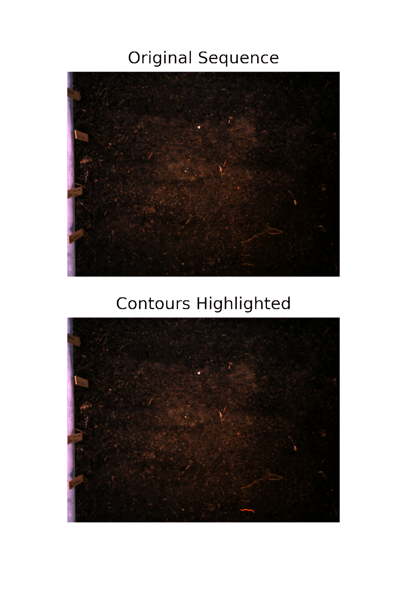

## Tracking Invasive Worms with Machine Learning and Computer Vision

New England has an invasive worm problem, disrupting ecosystems and causing economic damage.
Several visual characteristics of these Pheretimoid earthworms suggest the possibility 
of using computer vision to identify them.
Their color is distinctive, and different from prefered populations of earthworms.
If a training set with accurate contours can be created, a model could be trained to
classify worm instances based on color.
The body proportions are also distinctive, in general longer and less fat than locally adapted earthworms.
The proportion of average pixel length to average pixel width could be useful in identifying them.
The clitellum (the ring around the body) is very light in color, and farther towards the front of the worm.
The average speed of the invasive worm is much higher than that of local earthworm populations in New England and the USA.
This speed can be calculated from several frames of video, provided it is timestamped, and
a length measurement card is visible in the image.
An estimate of the speed of the worm in the above animation is roughly 2 inches/minute, rather slow, making this specimen not likely to be invasive.
